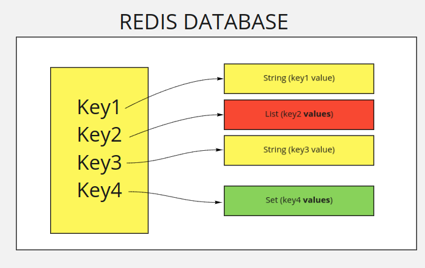

# Redis as a Key Value Store

Let's start with the aforementioned concept of key/value store. As opposed to Relational Databases, 
where objects are stored in tables, Redis stores objects as a map of a key to a value. 
All the keys are basically simple strings, but values can be of different types: Strings, Lists, Sets, etc. 
We will go over each one of the types in its own section. 

But you can imagine the Redis database as something like this following graph.




As you can see in the presented Redis Database example above, we have 4 pairs of keys/values, 2 of type string, 1 of type 
list, and 1 of type list. But all the keys are simple strings "key1", "key2", "key3", "key4".

To interact with Redis as a user or as an application, Redis receives simple commands in this format

```
COMMAND [LIST ARGUMENTS]
```

For example, in our sample database before, if you want to know the type of some key, you can 
send the command [type](https://redis.io/commands/type), followed by the **key** you want to know its type. Redis will simply reply 
with a string that represents the type of the string.

Running these commands against our previous example sample database, will give these corresponding values

| Command       | Result           |
| ------------- |:-------------:| -----:|
| type key1      | string |
| type key2      | list |
| type foobar      | none |

As you can see, asking for a type of a key that doesn't exist, returns none.

In Redis, all key/value pairs are independant from each other. There is no relation or 
constraint that joins one to any other pair, as opposed to foreign key 
constraints that we are familiar with, in relational databases.

Redis commands receive different numbers and types of arguments. Some commands don't receive arguments at all. For example, if 
we want to know the number of the keys in the database, we can use some other command [dbsize](https://redis.io/commands/dbsize)
that will simply return the number of the items in the database. If we run it against our database above, we should get (4).

| Command       | Result           |
| ------------- |:-------------:| -----:|
| dbsize      | 4 |

So now that we are familiar with the basic principles of what a redis database is, let's get into more 
examples of the simplest type of objects that we can store in a Redis database, **strings**. In the next section.
